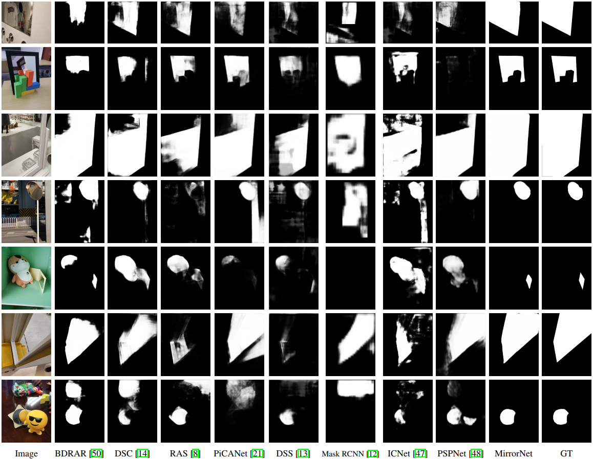

# ICCV2019_MirrorNet

## Where Is My Mirror? (ICCV2019)
Xin Yang\*, [Haiyang Mei](https://mhaiyang.github.io/)\*, Ke Xu, Xiaopeng Wei, Baocai Yin, [Rynson W.H. Lau](http://www.cs.cityu.edu.hk/~rynson/)<sup>&dagger;</sup> (* Joint first authors, <sup>&dagger;</sup> Rynson Lau is the corresponding author and he led this project.)

[[Project Page](https://mhaiyang.github.io/ICCV2019_MirrorNet/index.html)][[Arxiv](https://arxiv.org/pdf/1908.09101.pdf)]

### Abstract
Mirrors are everywhere in our daily lives. Existing computer vision systems do not consider mirrors, and hence may get confused by the reflected content inside a mirror, resulting in a severe performance degradation. However, separating the real content outside a mirror from the reflected content inside it is non-trivial. The key challenge lies in that mirrors typically reflect contents similar to their surroundings, making it very difficult to differentiate the two. In this paper, we present a novel method to accurately segment mirrors from an input image. To the best of our knowledge, this is the first work to address the mirror segmentation problem with a computational approach. We make the following contributions. First, we construct a large-scale mirror dataset that contains mirror images with the corresponding manually annotated masks. This dataset covers a variety of daily life scenes, and will be made publicly available for future research. Second, we propose a novel network, called MirrorNet, for mirror segmentation, by modeling both semantical and low-level color/texture discontinuities between the contents inside and outside of the mirrors. Third, we conduct extensive experiments to evaluate the proposed method, and show that it outperforms the carefully chosen baselines from the state-of-the-art detection and segmentation methods.

### Citation
If you use this code or our dataset (including test set), please cite:

```
@InProceedings{Yang_2019_ICCV, 
    author = {Yang, Xin and Mei, Haiyang and Xu, Ke and Wei, Xiaopeng and Yin, Baocai and Rynson, W.H. Lau}, 
    title = {Where Is My Mirror?}, 
    booktitle = {IEEE International Conference on Computer Vision (ICCV)}, 
    year = {2019}
}
```

### Dataset
See [Peoject Page](https://mhaiyang.github.io/ICCV2019_MirrorNet/index.html)

### Requirements
* PyTorch == 0.4.1
* TorchVision == 0.2.1
* CUDA 9.0  cudnn 7
* Setup
```
sudo pip3 install -r requirements.txt
git clone https://github.com/Mhaiyang/dss_crf.git
sudo python setup.py install
```

### Test
Download trained model `MirrorNet.pth` at [here](https://mhaiyang.github.io/ICCV2019_MirrorNet/index.html), then run `infer.py`.

### Updated Main Results

##### Quantitative Results

| method | CRF | IOU | Acc | F | MAE | BER |  
| :--- | :---: | :---: | :---: | :---: | :---: | :---: |  
| Statistics | - | 30.83 | 0.595 | 0.438 | 0.358 | 32.89 |
| PSPNet | - | 63.21 | 0.750 | 0.746 | 0.117 | 15.82 |
| ICNet | - | 57.25 | 0.694 | 0.710 | 0.124 | 18.75 |
| Mask RCNN | - | 63.18 | 0.821 | 0.756 | 0.095 | 14.35 |
| DSS | - | 59.11 | 0.665 | 0.743 | 0.125 | 18.81 |
| PiCANet | - | 71.78 | 0.845 | 0.808 | 0.088 | 10.99 |
| RAS | - | 60.48 | 0.695 | 0.758 | 0.111 | 17.60 |
| R<sup>3</sup>Net w/o C | - | 72.69 | 0.805 | 0.840 | 0.080 | 11.46 |
| R<sup>3</sup>Net | &radic; | 73.21 | 0.805 | 0.846 | 0.068 | 11.39 |
| DSC | - | 69.71 | 0.816 | 0.812 | 0.087 | 11.77 |
| BDRAR w/o C | - | 67.01 | 0.822 | 0.799 | 0.099 | 12.46 |
| BDRAR | &radic; | 67.43 | 0.821 | 0.792 | 0.093 | 12.41 |
| MirrorNet w/o C | - | 78.46 | 0.933 | 0.857 | 0.085 | 6.46 |
| MirrorNet | &radic; | 78.95 | 0.933 | 0.857 | 0.065 | 6.39 |

##### Component analysis

| Networks | IOU | Acc | BER |  
| :--- | :---: | :---: | :---: |
| basic + BCE loss | 74.03 | 0.821 | 10.60 |
| basic + lovasz-hinge loss | 75.36 | 0.820 | 10.44 |
| basic + CCFE w/o contrasts | 78.59 | 0.851 | 8.55 |
| basic + CCFE w/ 1B4C | 76.36 | 0.882 | 8.01 |
| basic + CCFE w/ 4B1C | 78.53 | 0.853 | 9.08 |
| MirrorNet | 78.95 | 0.933 | 6.39 |

##### Qualitative Results


### License
Please see `license.txt` 

### Contact
E-Mail: mhy666@mail.dlut.edu.cn
